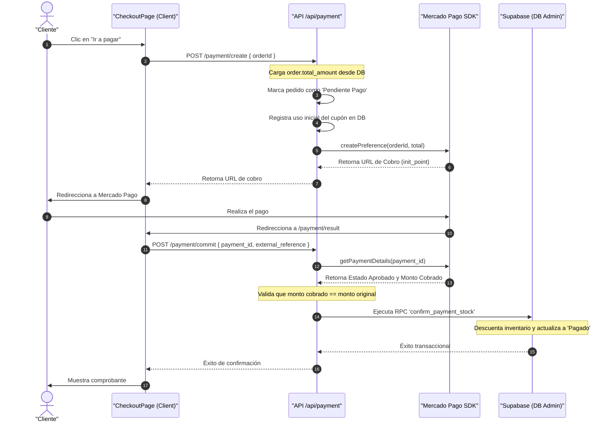

# 🏛️ Documento de Arquitectura - Joyas Fran

Este documento detalla el diseño de la arquitectura del e-commerce **Joyas Fran**, la estructura de directorios, la separación de responsabilidades por capas y los flujos críticos de la aplicación.

---

## 🏗️ 1. Estructura de Capas y Responsabilidades

La aplicación sigue una **arquitectura en capas desacoplada** sobre el framework Next.js 16, estructurando el código de la siguiente manera:

```text
joyas-fran/
├── app/              # Capa de Presentación, Páginas y Controladores (Server/Client Pages y API Routes)
├── components/       # Capa de UI y Componentes de Presentación Reutilizables
├── services/         # Capa de Servicios (Contiene la lógica de negocio y queries a BD)
├── types/            # Capa de Definiciones de Datos y Contratos (Modelos e interfaces DTO)
└── lib/              # Capa de Utilidades, Clientes Singletón y Configuraciones Base
```

### Detalle de Capas:

*   **`app/` (Páginas y API Routes):**
    *   *Páginas:* Capturan la entrada del usuario, cargan datos iniciales mediante Server Components o `useEffect` y delegan la renderización en componentes de UI.
    *   *API Routes:* Actúan como controladores REST que reciben peticiones del cliente, invocan a los servicios correspondientes y retornan respuestas con formato unificado.
*   **`components/` (Componentes de UI):**
    *   Componentes aislados de la lógica de negocio y consultas a base de datos. Reciben datos a través de props y emiten eventos a través de funciones callback.
*   **`services/` (Lógica de Negocio):**
    *   Encapsula las llamadas a la base de datos (Supabase) y a las APIs externas (Mercado Pago).
    *   Aísla el esquema físico de las tablas mediante el uso de **DTOs (Data Transfer Objects)**.
*   **`types/` (Tipos y Contratos):**
    *   Define interfaces estrictas para modelar las entidades de la base de datos y los contratos de datos (DTOs) consumidos por las vistas del frontend.
*   **`lib/` (Infraestructura y Configuración):**
    *   Centraliza la instanciación de dependencias (singletons de Supabase para cliente, servidor y administrador) y variables de configuración globales.

---

## 🔒 2. Flujo de Autenticación y Seguridad

La autenticación está delegada en **Supabase Auth** y se compone de tres elementos de protección:

1.  **Frontend (Browser Client):**
    *   El singleton `supabaseBrowser` en `lib/supabase-browser.ts` gestiona el token JWT en el navegador, controlando las vistas locales de sesión en `AccountPage` y `Header`.
2.  **Servidor (Edge Proxy Middleware):**
    *   El archivo de configuración [proxy.ts](file:///c:/Users/Esteban/Desktop/proyectosT/joyas-fran/proxy.ts) intercepta todas las peticiones entrantes en el servidor.
    *   Verifica la firma del token JWT utilizando `supabase.auth.getUser()`. Si la sesión es inválida o expiró, redirige al usuario a `/login`.
    *   En la ruta `/admin`, restringe el acceso validando el email contra la variable segura de servidor `ADMIN_EMAIL`.
3.  **Base de Datos (Row Level Security - RLS):**
    *   Todas las consultas anon o autenticadas a nivel de cliente son auditadas en PostgreSQL mediante políticas RLS. El acceso administrativo a datos de facturación e inventario está bloqueado para usuarios sin privilegios.

---

## 💳 3. Flujo de Checkout y Pagos

El flujo de checkout está diseñado para prevenir la manipulación de montos del lado del cliente y garantizar que el descuento de stock ocurra únicamente tras verificar el pago exitoso:



### Puntos clave de seguridad:
*   El cliente **nunca** define el precio de cobro en la pasarela; el backend de la tienda consulta el total del pedido en la base de datos de manera interna.
*   El contador de cupones se incrementa y registra en `coupon_usage` en el backend durante la inicialización de preferencia, controlando duplicaciones en caso de reintentos mediante comprobación de uso por ID de orden.
*   La confirmación (`commit`) del pago valida que la cantidad abonada en Mercado Pago coincida exactamente con el precio registrado del pedido, bloqueando compras fraudulentas de montos menores.
