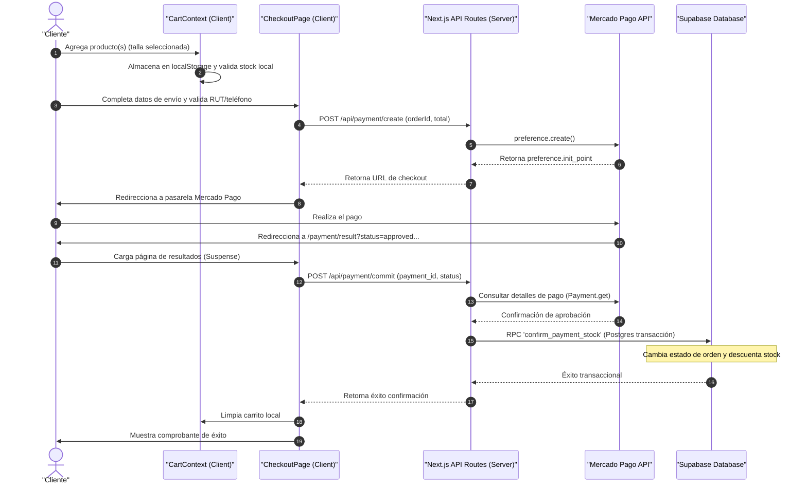

# 💍 Joyas Fran - Plataforma E-Commerce de Joyería en Plata

[](https://nextjs.org/)
[](https://react.dev/)
[](https://supabase.com/)
[](https://tailwindcss.com/)
[](https://www.mercadopago.cl/)

Plataforma e-commerce para la marca **Joyería Fran** (Iquique, Chile). El sistema implementa un flujo de venta online de joyas de plata, incluyendo carro de compras con persistencia local, cupones de descuento, cálculo de despacho y pasarela de pago (Mercado Pago) con control de inventario.

🔗 **Sitio de Producción:** [joyas-fran.vercel.app](https://joyas-fran.vercel.app/)

---

## 📊 Auditoría y Calidad del Repositorio

Para un análisis del código, de la arquitectura y de la deuda técnica identificada en este proyecto, consulta el reporte de revisión técnica:
📄 **[Reporte de Revisión del Repositorio (REVIEW_REPORT.md)](file:///c:/Users/Esteban/Desktop/proyectosT/joyas-fran/REVIEW_REPORT.md)**

---

## 📸 Visual Showcase (Capturas de Pantalla)

> [!TIP]
> *Reemplaza estos marcadores con imágenes reales de tu e-commerce para personalizar la presentación.*

| Catálogo e Interfaz de Productos | Checkout y Cálculo de Despacho |
| :---: | :---: |
|  |  |

---

## 🏛️ Arquitectura del Sistema y Flujo de Compra

La aplicación utiliza API Routes de Next.js para gestionar los pagos y validaciones, sincronizando el estado en el cliente.

El siguiente diagrama detalla cómo se orquesta la compra, el pago y la deducción de stock a nivel de base de datos Postgres:



---

## 🌟 Características de la Aplicación

### 1. Manejo del Carrito (Context API)
*   **CartContext Global:** El carrito de compras ([context/CartContext.tsx](file:///c:/Users/Esteban/Desktop/proyectosT/joyas-fran/context/CartContext.tsx)) gestiona la agregación, eliminación y conteo de ítems con sus respectivas tallas, sincronizando el estado del carrito en el cliente después del montaje para evitar diferencias de hidratación (hydration mismatches).
*   **Precios de Oferta:** Soporte para precios rebajados (`compare_at_price`), permitiendo calcular visualmente los descuentos aplicados por artículo en el carrito.

### 2. Cálculo de Tarifas de Envío
*   **Entrega Local Gratuita:** Para las comunas de Iquique y Alto Hospicio, el endpoint `/api/shipping` detecta la coincidencia geográfica y establece la tarifa de despacho en $0 (mostrando el valor original tachado en el carrito).
*   **Tarifas Regionales:** Para las demás comunas, consulta la tabla `shipping_rates` para obtener precios y plazos de entrega, con opción de retiro presencial sin costo.
*   **Umbral de Envío Gratis:** Despacho gratuito automático para compras superiores a $100.000 CLP.

### 3. Validación de Cupones
*   **Validación en Servidor:** El endpoint `/api/validate-coupon` verifica la vigencia del código en la tabla `coupons`, el cumplimiento de la compra mínima requerida (`min_purchase`) y el tipo de descuento (porcentaje o monto fijo), calculando el total en el servidor para evitar manipulaciones en el cliente.

### 4. Compresión de Imágenes en Calidad WebP
*   **Procesamiento en Cliente:** La administración de productos cuenta con una función de optimización ([app/admin/page.tsx](file:///c:/Users/Esteban/Desktop/proyectosT/joyas-fran/app/admin/page.tsx#L97-L131)) que comprime archivos JPG/PNG subidos a formato `.webp` (calidad 80%, máximo 1200px) antes de enviarlas al storage de Supabase.

---

## 📂 Estructura del Proyecto

```text
joyas-fran/
├── app/                      # Estructura del App Router (Next.js 16)
│   ├── admin/                # Panel de control de administración del e-commerce
│   │   ├── cupones/          # Gestión de códigos de descuento
│   │   └── page.tsx          # Resumen de ventas, CRUD de productos y pedidos
│   ├── api/                  # Endpoints del backend (Serverless API Routes)
│   │   ├── auth/             # Autenticación y control de accesos
│   │   ├── payment/          # Creación, verificación y rollback de pasarelas de pago
│   │   ├── shipping/         # Cálculo dinámico de despacho regional y local
│   │   └── validate-coupon/  # Validación de códigos promocionales
│   ├── carrito/              # Página del carro de compras detallada
│   ├── catalogo/             # Filtros de catálogo por categorías
│   ├── checkout/             # Página del formulario de datos y despacho
│   ├── login/ / registro/    # Portales de autenticación de clientes
│   ├── page.tsx              # Landing page principal (Banners y ofertas)
│   └── payment/result/       # Retorno de confirmación de pasarelas de pago
├── components/               # Componentes atómicos de UI y layout
├── context/                  # Contextos de estado global (CartContext)
├── lib/                      # Archivos de inicialización y datos geográficos chilenos
└── public/                   # Activos estáticos del proyecto (imágenes, iconos)
```

---

## 🛠️ Instalación y Configuración Local

1.  **Clonar el repositorio:**
    ```bash
    git clone https://github.com/Tebias-cloud/joyas-fran.git
    cd joyas-fran
    ```

2.  **Instalar dependencias:**
    ```bash
    npm install
    ```

3.  **Configurar Variables de Envío (.env.local):**
    Crea un archivo `.env.local` en la raíz del proyecto y agrega tus claves:
    ```ini
    NEXT_PUBLIC_SUPABASE_URL=https://tu-proyecto.supabase.co
    NEXT_PUBLIC_SUPABASE_ANON_KEY=tu-anon-key-para-clientes
    SUPABASE_SERVICE_ROLE_KEY=tu-service-role-key-para-confirmacion-de-stock
    MP_ACCESS_TOKEN=tu-access-token-de-mercado-pago
    NEXT_PUBLIC_SITE_URL=http://localhost:3000
    ```

4.  **Iniciar Servidor de Desarrollo:**
    ```bash
    npm run dev
    ```

---

## ⚙️ Decisiones Técnicas y Base de Datos

*   **Esquema de Base de Datos (Supabase PostgreSQL):**
    *   `products`: Tabla de artículos con Slug único, precios, categoría e inventario segmentado por tallas en formato JSON (`inventory`).
    *   `orders`: Registra los detalles del pedido, datos geográficos de despacho, cupones aplicados y estados (`Pendiente Pago`, `Pagado`, `Preparando`, `Enviado`, `Entregado`).
    *   `shipping_rates`: Tabla relacional indexada por región con precios estándar de despachos.
    *   `coupons`: Códigos promocionales parametrizables.
    *   `store_settings`: Configuración genérica de categorías y tallas administradas dinámicamente.
*   **Protección de Stock en Base de Datos (Postgres RPC):**
    Para asegurar atomicidad y evitar que dos compras concurrentes vendan el mismo producto sin stock, el endpoint de confirmación (`/api/payment/commit`) llama a la función de base de datos `confirm_payment_stock` que valida y descuenta el stock en una única transacción PostgreSQL bloqueando la fila afectada.

---

## 🛠️ Problemas Solicitados y Soluciones de Ingeniería

*   **Prevención de Cliks Duplicados en Carro:** Implementa un bloqueo en cliente (`CartContext.tsx`) mediante una referencia mutable (`lastOpRef`) que impide que clicks continuados a un botón de compra inserten múltiples veces el mismo elemento en un intervalo menor a 500ms.
*   **Idempotencia en Éxito de Pago:** En la redirección de Mercado Pago, si el cliente actualiza el navegador, el endpoint `/api/payment/commit` intercepta el estado de la orden antes de ejecutar el procedimiento almacenado. Si el pedido ya figura como Pagado, retorna éxito inmediato sin alterar de nuevo el stock ni duplicar operaciones.

---

## 🔮 Futuras Mejoras (Roadmap Técnico)

1.  **Activación de Middleware en Servidor:** Renombrar el archivo `proxy.ts` a `middleware.ts` para que Next.js compile y ejecute la validación de Supabase Auth a nivel de HTTP, protegiendo adecuadamente las rutas `/checkout`, `/cuenta` y `/admin`.
2.  **Unificación de Pasarela de Pago:** Migrar la ruta legacy `/api/payment/rollback` que depende de `transbank-sdk` para que use exclusivamente Mercado Pago en consonancia con el resto del backend de pagos.
3.  **Implementación de Testing Automatizado:** Agregar pruebas unitarias para el algoritmo del dígito verificador RUT y la validación de cupones.

---

## 📄 Licencia
Este proyecto está bajo la Licencia **MIT**. Consulta el archivo `LICENSE` para más detalles.
