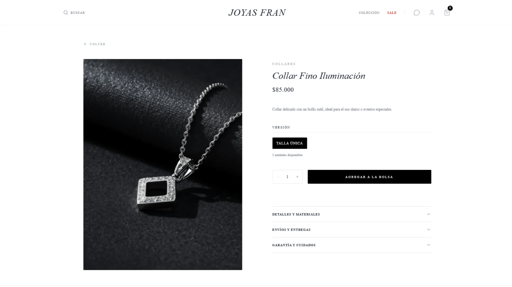
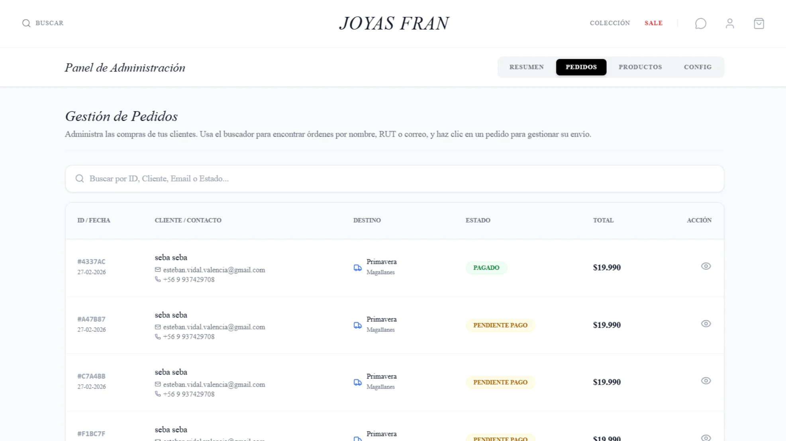

# 💍 Joyas Fran - Plataforma E-Commerce de Joyería en Plata

[](https://nextjs.org/)
[](https://react.dev/)
[](https://supabase.com/)
[](https://tailwindcss.com/)
[](https://www.mercadopago.cl/)

Plataforma e-commerce lista para producción desarrollada para **Joyería Fran** (Iquique, Chile). El sistema implementa un flujo de venta completo de joyas en plata ley 925, incluyendo carrito de compras persistente, validación y aplicación de cupones, cálculo dinámico de despachos regionales y pasarela de pago segura con control atómico de stock.

---

## 📸 Capturas de Pantalla (Visual Showcase)

| Vista 1 - Catálogo & Landing | Vista 2 - Detalle del Producto | Vista 3 - Panel de Administración |
| :---: | :---: | :---: |
|  |  |  |

---

## 🏛️ Arquitectura del Sistema y Flujo transaccional

La aplicación utiliza API Routes de Next.js para gestionar los cobros y validaciones del lado del servidor, manteniendo sincronizado el estado del carrito local en el cliente.

El siguiente diagrama detalla cómo se orquesta la compra, el pago y la deducción de stock a nivel de base de datos Postgres:


---

## 🌟 Características Clave

### 1. Panel de Administración Avanzado (Shopify-Style UX)
*   **Gestión Total de Catálogo**: Creación, edición, duplicación, desactivación y eliminación de productos de forma 100% visual.
*   **Duplicación Rápida**: Duplica cualquier joya en un clic para crear variantes del producto de forma rápida sin rellenar datos redundantes.
*   **Subida Drag-and-Drop y Reemplazo**: Zona de carga interactiva de archivos. Permite ordenar imágenes mediante controles visuales, seleccionar portada e incluso reemplazar fotos en índices específicos arrastrando archivos sobre ellas.
*   **Optimización de Imágenes**: Compresión en cliente a formato WebP antes de subirlas al bucket de Supabase, minimizando el consumo de almacenamiento y acelerando los tiempos de carga en dispositivos móviles.
*   **Creador de Categorías Inline**: Añade categorías directamente desde el selector de productos mediante un modal secundario, sin perder los cambios del producto actual.
*   **Previsualización SEO y Slug Automático**: Genera slugs URL dinámicamente según el nombre del producto y proporciona una previsualización interactiva de los resultados en Google Search letra por letra.

### 2. Pasarela de Pagos Segura (Mercado Pago)
*   **Deducción Atómica de Stock**: Bloquea y descuenta el stock en la base de datos PostgreSQL mediante un procedimiento almacenado (`confirm_payment_stock`) al confirmarse el cobro.
*   **Reembolso Automático Fallback**: En caso de compras simultáneas concurrentes donde el stock se agote antes de la confirmación final de pago, el webhook cancela la orden y reembolsa el dinero automáticamente llamando a la API de Mercado Pago.
*   **Idempotencia de Notificaciones**: Los endpoints `/api/payment/commit` y `/api/payment/webhook` procesan de forma exclusiva la confirmación de la orden, previniendo duplicación de stock o estados en reintentos.

### 3. Logística de Despachos y Cupones
*   **Cálculo Dinámico de Envíos**: Despacho regional mapeado para todo Chile (comunas e Iquique local) y retiro gratuito en tienda física.
*   **Validación de Cupones**: Comprobación en servidor de validez, expiración, mínimo de compra y límite de un uso único por cuenta de cliente para evitar abusos promocionales.

---

## 🛠️ Tecnologías y Stack

*   **Frontend**: Next.js 16 (App Router), React 19, Tailwind CSS 3
*   **Backend**: Next.js Serverless API Routes
*   **Base de Datos**: Supabase / PostgreSQL (Triggers, RLS y RPCs)
*   **Pasarela de Pago**: Mercado Pago SDK
*   **Iconografía**: Lucide React
*   **Alertas**: Sonner (Toast)

---

## ⚙️ Configuración y Variables de Entorno (.env.local)

Crea un archivo `.env.local` en la raíz del proyecto para la ejecución local:

```ini
# Supabase Client & Admin Keys
NEXT_PUBLIC_SUPABASE_URL=https://tu-proyecto.supabase.co
NEXT_PUBLIC_SUPABASE_ANON_KEY=tu-anon-key-para-clientes
SUPABASE_SERVICE_ROLE_KEY=tu-service-role-key-admin-para-transacciones

# Mercado Pago credentials
MP_ACCESS_TOKEN=tu-access-token-de-mercado-pago

# Site configuration
NEXT_PUBLIC_SITE_URL=http://localhost:3000
```

---

## 🚀 Instalación y Despliegue Local

1.  **Instalar dependencias**:
    ```bash
    npm install
    ```

2.  **Ejecutar entorno de desarrollo**:
    ```bash
    npm run dev
    ```

3.  **Compilar y empaquetar para producción**:
    ```bash
    npm run build
    ```

4.  **Ejecutar linter**:
    ```bash
    npm run lint
    ```

---

## 📄 Licencia

Este proyecto está bajo la Licencia **MIT**. Consulta el archivo `LICENSE` para más detalles.
